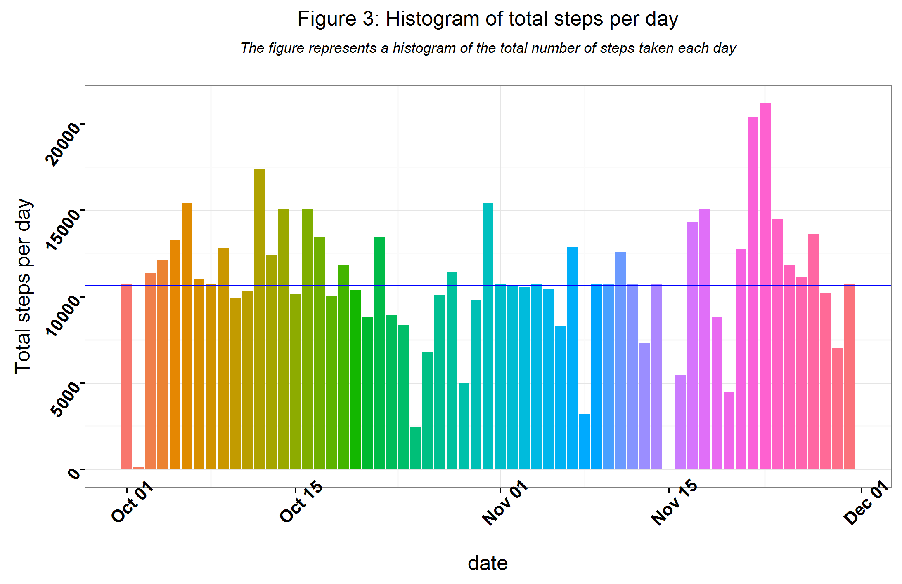
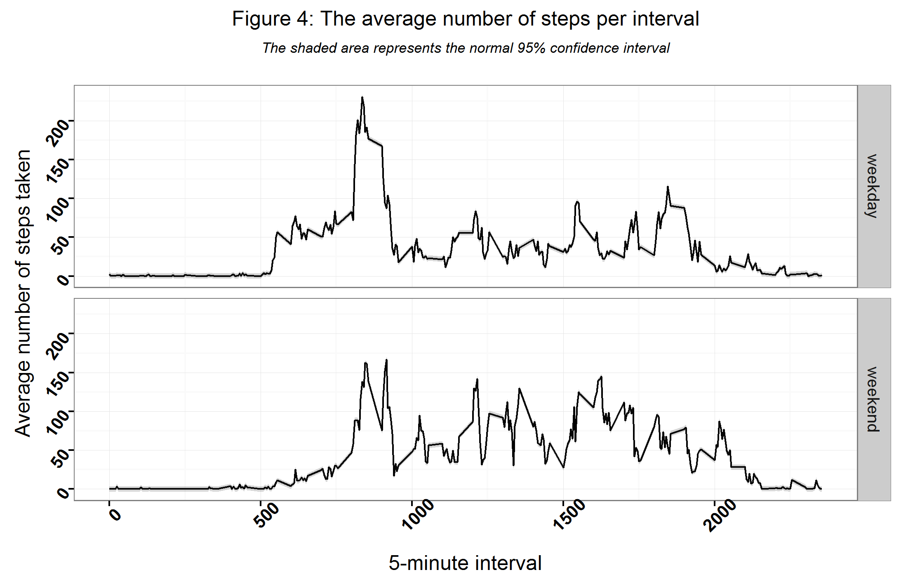

## Loading and preprocessing the data
The data was provided in a csv file (activity.csv) as a zipped file and there are a total of 17,568 observations in this dataset. The variables included in this dataset are:

**steps**: Number of steps taking in a 5-minute interval (missing values are coded as NA)

**date**: The date on which the measurement was taken in YYYY-MM-DD format

**interval**: Identifier for the 5-minute interval in which measurement was takenwith three columns representing

```
library(curl)
library(ggplot2)

# Unzip activity.zip file
unzip(zipfile="activity.zip", overwrite = TRUE)

# Load provided data (use relative paths)
activityDS <- read.csv(file = './activity.csv', stringsAsFactors = FALSE)

# Change class for the date variable
activityDS$date <- as.Date(activityDS$date,'%Y-%m-%d')

```

A sample of the data.

```
>tail(activityDS)
      steps       date interval
17563    NA 2012-11-30     2330
17564    NA 2012-11-30     2335
17565    NA 2012-11-30     2340
17566    NA 2012-11-30     2345
17567    NA 2012-11-30     2350
17568    NA 2012-11-30     2355

```


## What is mean total number of steps taken per day?

```
# Summarize the data by day
dailyActivity <-  aggregate(formula = steps~date, data = activityDS, FUN = sum, na.rm=TRUE)

# Calculate summary statistics
dailyMeanActivity <-  aggregate(formula = steps~date, data = activityDS, FUN = mean, na.rm=TRUE)
RangeMeanActivity <-  round(range(dailyMeanActivity$steps, na.rm = TRUE))

meanSteps <- round(mean(dailyActivity$steps), 2)
medianSteps <- quantile(x = dailyActivity$steps, probs = 0.5) 
```
Sample Results:
```
> head(dailyActivity)
        date steps
1 2012-10-02   126
2 2012-10-03 11352
3 2012-10-04 12116
4 2012-10-05 13294
5 2012-10-06 15420
6 2012-10-07 11015
> head(dailyMeanActivity)
        date    steps
1 2012-10-02  0.43750
2 2012-10-03 39.41667
3 2012-10-04 42.06944
4 2012-10-05 46.15972
5 2012-10-06 53.54167
6 2012-10-07 38.24653
> RangeMeanActivity
[1]  0 74
> meanSteps
[1] 10766.19
> medianSteps
  50% 
10765 

```
The mean of steps is 10766.19 and a median of steps is 10765 per day.
The number of steps taken daily by the subject are represented in the Figure 1 below.

```
title1 <- "Figure 1: Histogram of total steps per day"
subtitle1 <- "The figure represents a histogram of the total number of steps taken each day"
gg1 <- ggplot(data=dailyActivity) + 
		 scale_colour_hue(name="Date",l=30) +
		 scale_y_continuous(name="Total steps per day") + 
		 ggtitle(bquote(atop(.(title1), atop(italic(.(subtitle1)), "")))) +
		 theme_bw() +
		 theme(legend.title=element_blank(), 
		    axis.text.x = element_text(face="bold", size=10, angle=45),
		    axis.text.y = element_text(face="bold", size=10, angle=55),
		    plot.title=element_text(face="bold", size=12)
		 ) +
		 #geom_text(size=2.5,hjust=.01, vjust=-.45,col="black", fontface="bold",aes(x=date,y=steps,label=as.integer(as.character(steps)))) +
		 geom_bar(stat="identity",position='dodge',aes(x=date, y=steps,fill=factor(date)), show.legend=FALSE) +
		 geom_hline(yintercept = c(meanSteps,medianSteps-100), col=c("red","blue"),size=.2, show.legend=TRUE) +
		 geom_hline(data=dailyMeanActivity,size=.2,yintercept = dailyMeanActivity$steps, col="green", linetype=2) 
 gg1
 ggsave("Fig1.png", gg1, width=185, height=120,units="mm")
```


## What is the average daily activity pattern?

```
# Aggregate the steps per interval, calculating the mean across the days

activityCompleteDS=subset(activityDS, complete.cases(activityDS))
averagesDS <-  aggregate(formula = steps~interval, data = activityCompleteDS, FUN = mean)
averagesDS$stepL = averagesDS$steps-(1.96*sd(averagesDS$steps)/sqrt(length(averagesDS$steps))) 
averagesDS$stepU = averagesDS$steps+(1.96*sd(averagesDS$steps)/sqrt(length(averagesDS$steps)))
# Get the data for the interval with the most average activity across the days
maxSteps <- activityCompleteDS[which(activityCompleteDS$steps==max(activityCompleteDS$steps)),]
```
Sample data from the dateset averagesDS with 95% confidence intervel (stepL - stepU). Maximum steps 806.
```
>head(averagesDS)
  interval     steps     stepL    stepU
1        0 1.7169811 -2.748522 6.182484
2        5 0.3396226 -4.125880 4.805126
3       10 0.1320755 -4.333428 4.597578
4       15 0.1509434 -4.314560 4.616446
5       20 0.0754717 -4.390031 4.540975
6       25 2.0943396 -2.371163 6.559843
> maxSteps
      steps       date interval
16492   806 2012-11-27      615
```
The following is the code to Plot the average number of steps per interval. The code used ggplot2 to find inconsistencies with the analysis. Geom 'line' is equivalent to 'type="l"' in plot.he shaded area represents the normal 95% confidence interval.

```
title1 <- "Figure 2: The average number of steps per interval"
subtitle1 <- "The shaded area represents the normal 95% confidence interval"
stepsPerInterval <- ggplot(data = averagesDS, aes(x = interval, y = steps)) + 
    geom_line() + 
    xlab("5-minute interval") + 
    ylab("Average number of steps taken") +
    ggtitle(bquote(atop(.(title1), atop(italic(.(subtitle1)), "")))) +
    theme_bw() +
		 theme(legend.title=element_blank(), 
		    axis.text.x = element_text(face="bold", size=10, angle=45),
		    axis.text.y = element_text(face="bold", size=10, angle=55),
		    plot.title=element_text(face="bold", size=12)
		 ) +
		 geom_ribbon(aes(ymin=stepL, ymax=stepU), alpha=0.2)

stepsPerInterval

ggsave("Fig2.png", stepsPerInterval, width=185, height=120,units="mm")

```


## Imputing missing values

1. The following code is to calculate and report the total number of missing values in the dataset (i.e. the total number of rows with NA)

```
missing <- is.na(activityDS$steps)
# How many missing
table(missing)

```
Results:
```
missing
FALSE  TRUE 
15264  2304

```
2. Here is the code to plan a strategy for filling in all of the missing values in the dataset. 

A new dataset is created named as filledTestData from original dataset with three extra columns named as fillWithDailyMean, fillWithDailyMedian, fillWithIntervalMean. The initial values for these new columns are same as column:steps values. All the missing values of these three new columns are filled as respectively with Daily Mean, Daily Median and Interval Mean. After that the data is visually compared.

```
                           
dailyMeanActivityDS <-  aggregate(formula = steps~date, data = activityDS, FUN = mean, na.rm=TRUE)
dailyMedianActivityDS <-  aggregate(formula = steps~date, data = activityDS, FUN = median, na.rm=TRUE)
intervalActivityDS <- aggregate(formula=steps~interval, data=activityDS, FUN=mean, na.rm=TRUE)

filledTestData <- activityDS
filledTestData$fillWithDailyMean <- activityDS$steps
filledTestData$fillWithDailyMedian <- activityDS$steps
filledTestData$fillWithIntervalMean <- activityDS$steps

# Replace each missing value with the mean value of its 5-minute interval
fillIntervalValue <- function(steps, interval) {
    filled <- NA
    if (!is.na(steps)) 
        filled <- c(steps) else filled <- (intervalActivityDS[intervalActivityDS$interval == interval, "steps"])
    return(filled)
}
# Replace each missing value with the Daily mean value 
fillMeanValue <- function(steps, date) {
    filled <- NA
    if (!is.na(steps)) 
        filled <- c(steps) else filled <- (dailyMeanActivityDS[dailyMeanActivityDS$date == date, "steps"])
    return(filled)
}
# Replace each missing value with the Daily median value 
fillMedianValue <- function(steps, date) {
    filled <- NA
    if (!is.na(steps)) 
        filled <- c(steps) else filled <- (dailyMedianActivityDS[dailyMedianActivityDS$date == date, "steps"])
    return(filled)
}

filledTestData$fillWithDailyMean <- mapply(fillMeanValue, filledTestData$steps, filledTestData$date)
filledTestData$fillWithIntervalMean <- mapply(fillIntervalValue, filledTestData$steps, filledTestData$interval)
filledTestData$fillWithDailyMedian <- mapply(fillMedianValue, filledTestData$steps, filledTestData$date)


```
Here a sample results with new three fill columns. From the result it is very clear that the Interval Mean will be a better option for replacing NA values of steps. All other two columns are still blank(NA).

```
> head(filledTestData)
  steps       date interval fillWithDailyMean fillWithDailyMedian fillWithIntervalMean
1    NA 2012-10-01        0                                                  1.7169811
2    NA 2012-10-01        5                                                  0.3396226
3    NA 2012-10-01       10                                                  0.1320755
4    NA 2012-10-01       15                                                  0.1509434
5    NA 2012-10-01       20                                                  0.0754717
6    NA 2012-10-01       25                                                  2.0943396
> 

```
3. Now a new dataset named as fillIntervalValue is create and column:steps is filled with the mean for that 5-minute interval if it is NA.

```
fillIntervalValue <- function(steps, interval) {
    filled <- NA
    if (!is.na(steps)) 
        filled <- c(steps) else filled <- (intervalActivityDS[intervalActivityDS$interval == interval, "steps"])
    return(filled)
}

intervalActivityDS <- aggregate(formula=steps~interval, data=activityDS, FUN=mean, na.rm=TRUE)


activityWithoutNA <- activityDS
activityWithoutNA$intervalMEANsteps <- mapply(fillIntervalValue, 
                                              intervalActivityDS$steps, 
                                              intervalActivityDS$interval)

# Replace the missing values
activityWithoutNA$steps <- ifelse(is.na(activityWithoutNA$steps),
                                 activityWithoutNA$intervalMEANsteps,
                                 activityWithoutNA$steps)
                                 
# Remove unnecesary data
activityWithoutNA$intervalMEANsteps <- NULL


```
Sample data of new Data set (activityWithoutNA)
```
> head(activityWithoutNA)
      steps       date interval
1 1.7169811 2012-10-01        0
2 0.3396226 2012-10-01        5
3 0.1320755 2012-10-01       10
4 0.1509434 2012-10-01       15
5 0.0754717 2012-10-01       20
6 2.0943396 2012-10-01       25

```
                           
4. A histogram of the total number of steps taken each day is created from the new dataset and Calculate and report the mean and median total number of steps taken per day. From these observations, it seems that the impact of imputing missing values on the total number of daily steps is negligible, so probably the original estimates have little bias due to missing values.

```
# Summarize the new data by day
dailyImputedActivity <- aggregate(formula = steps~date, data = activityWithoutNA, FUN = sum, na.rm=TRUE)

# Calculate summary statistics
meanImputedSteps <- round(mean(dailyImputedActivity$steps), 2)
medianInputSteps <- quantile(x = dailyImputedActivity$steps, probs = 0.5)

```
Sample Results:

```
> head(dailyImputedActivity)
        date    steps
1 2012-10-01 10766.19
2 2012-10-02   126.00
3 2012-10-03 11352.00
4 2012-10-04 12116.00
5 2012-10-05 13294.00
6 2012-10-06 15420.00
> meanImputedSteps
[1] 10766.19
> medianInputSteps
     50% 
10766.19 

```
Figure 3 is the plotting of new dataset which is clearly showing no missing data.

```
title1 <- "Figure 3: Histogram of total steps per day"
subtitle1 <- "The figure represents a histogram of the total number of steps taken each day"
gg1 <- ggplot(data=dailyImputedActivity) + 
		 scale_colour_hue(name="Date",l=30) +
		 scale_y_continuous(name="Total steps per day") + 
		 ggtitle(bquote(atop(.(title1), atop(italic(.(subtitle1)), "")))) +
		 theme_bw() +
		 theme(legend.title=element_blank(), 
		    axis.text.x = element_text(face="bold", size=10, angle=45),
		    axis.text.y = element_text(face="bold", size=10, angle=55),
		    plot.title=element_text(face="bold", size=12)
		 ) +
		 #geom_text(size=2.5,hjust=.01, vjust=-.45,col="black", fontface="bold",aes(x=date,y=steps,label=as.integer(as.character(steps)))) +
		 geom_bar(stat="identity",position='dodge',aes(x=date, y=steps,fill=factor(date)), show.legend=FALSE) +
		 geom_hline(yintercept = c(meanImputedSteps,medianInputSteps-100), col=c("red","blue"),size=.2, show.legend=TRUE)  
 gg1
 ggsave("Fig3.png", gg1, width=185, height=120,units="mm")
 
```




## Are there differences in activity patterns between weekdays and weekends?

1. A new factor variable is created in the dataset with two levels -- "weekday" and "weekend" indicating whether a given date is a weekday or weekend day.

```
# Label each date as weekday/weekend 
activityWithoutNA$day <- factor(ifelse(as.integer(format(activityWithoutNA$date, format = '%u')) %in% c(1:5), 'weekday', 'weekend'))

```
Sample Results:
```
> head(activityWithoutNA)
      steps       date interval      day
1 1.7169811 2012-10-01        0  weekday
2 0.3396226 2012-10-01        5  weekday
3 0.1320755 2012-10-01       10  weekday
4 0.1509434 2012-10-01       15  weekday
5 0.0754717 2012-10-01       20  weekday
6 2.0943396 2012-10-01       25  weekday
```
2. A panel plot containing a time series plot (i.e. type = "l") of the 5-minute interval (x-axis) is created in Figure 4 and the average number of steps taken, averaged across all weekday days or weekend days (y-axis)

```
averagesWithoutNA <- aggregate(steps ~ interval + day, data = activityWithoutNA, mean)
averagesWithoutNA$stepL = averagesWithoutNA$steps-(1.96*sd(averagesWithoutNA$steps)/sqrt(length(averagesWithoutNA$steps))) 
averagesWithoutNA$stepU = averagesWithoutNA$steps+(1.96*sd(averagesWithoutNA$steps)/sqrt(length(averagesWithoutNA$steps)))


title1 <- "Figure 4: The average number of steps per interval"
subtitle1 <- "The shaded area represents the normal 95% confidence interval"
stepsPerInterval <- ggplot(data = averagesWithoutNA, aes(x = interval, y = steps)) + 
    geom_line() + 
    xlab("5-minute interval") + 
    ylab("Average number of steps taken") +
    ggtitle(bquote(atop(.(title1), atop(italic(.(subtitle1)), "")))) +
    theme_bw() +
		 theme(legend.title=element_blank(), 
		    axis.text.x = element_text(face="bold", size=10, angle=45),
		    axis.text.y = element_text(face="bold", size=10, angle=55),
		    plot.title=element_text(face="bold", size=12)
		 ) +
		 geom_ribbon(aes(ymin=stepL, ymax=stepU), alpha=0.2)+
		 facet_grid(day ~ .) 

stepsPerInterval

ggsave("Fig4.png", stepsPerInterval, width=185, height=120,units="mm")

```

